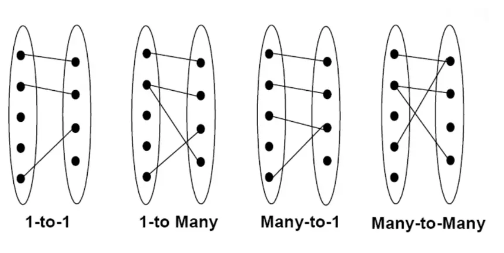
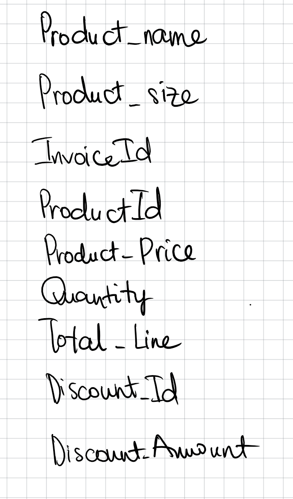
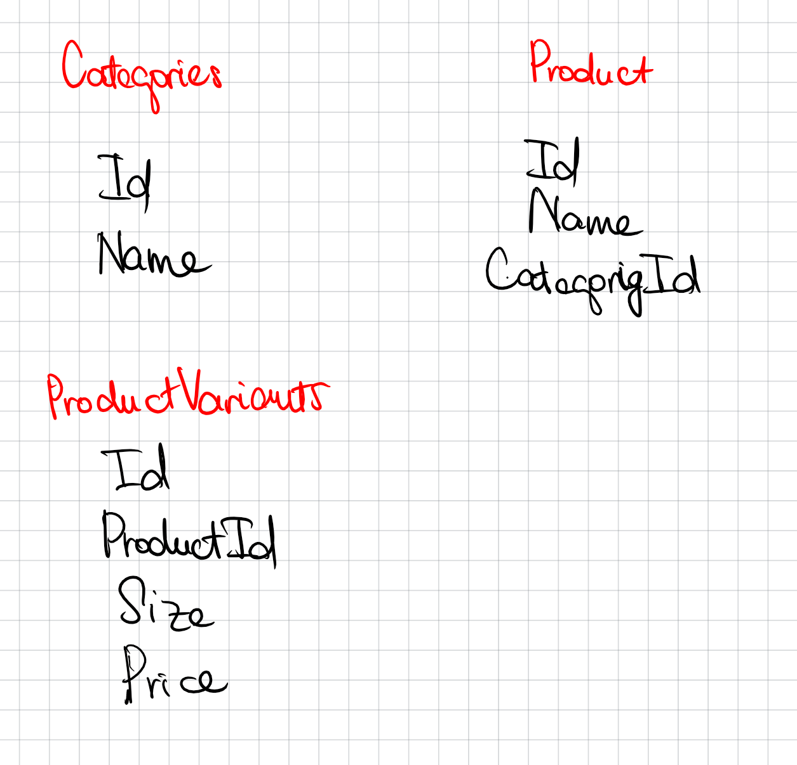
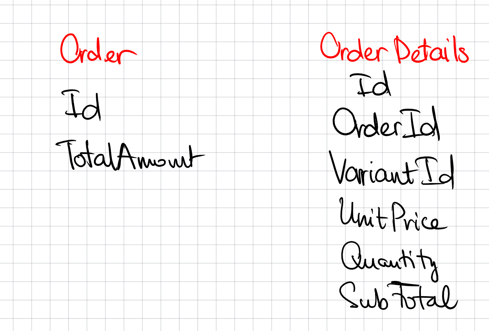
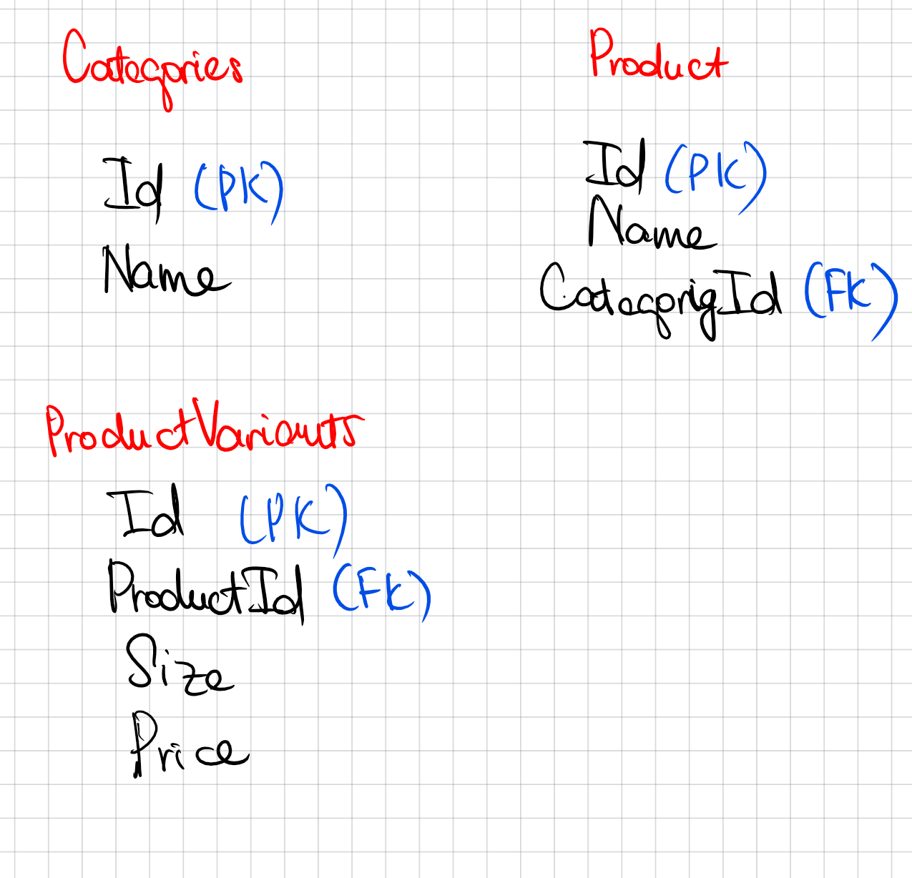
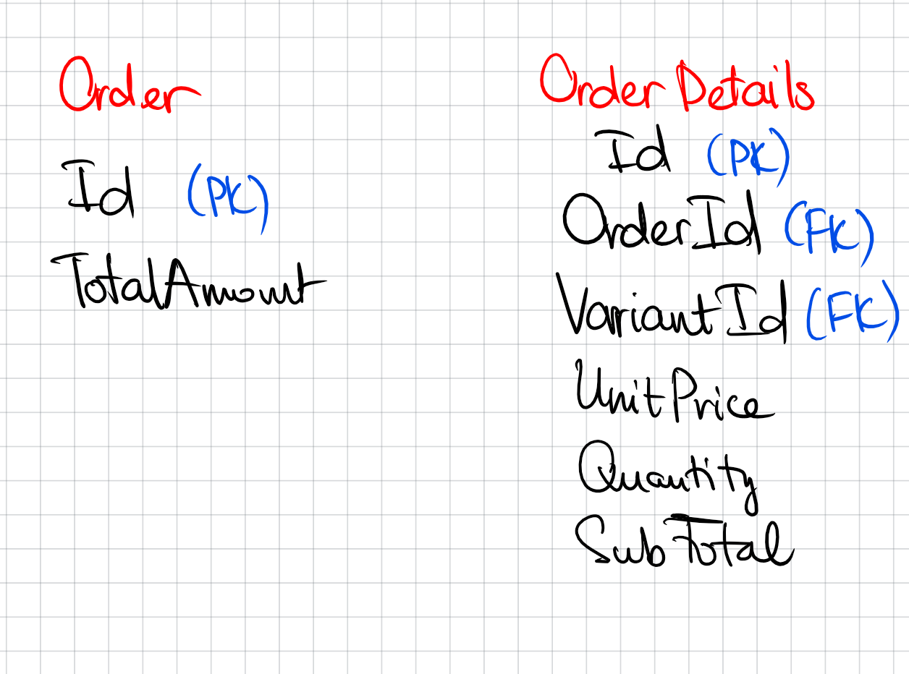
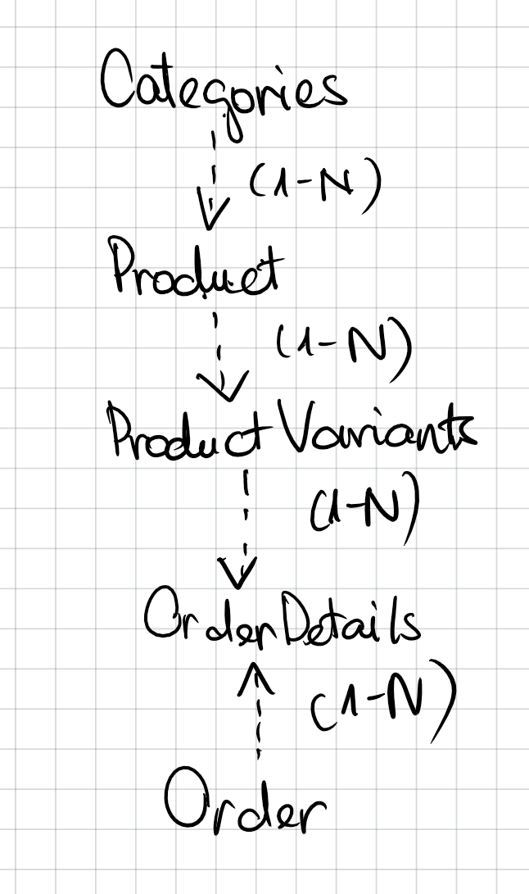

# Buổi 2: CƠ BẢN VỀ THIẾT KẾ CƠ SỞ DỮ LIỆU

## I. Tổng quan buổi học
### 1. Lý thuyết cơ bản về thiết kế cơ sở dữ liệu.
### 2. Lược đồ quan hệ E-R.
### 3. Mô hình dữ liệu quan hệ.
### 4. Chuẩn hóa dữ liệu: 1NF, 2NF, 3NF.

## II. Lý thuyết cơ bản về thiết kế CSDL
### 1. Khái niệm
Thiết kế cấu trúc cơ sở dữ liệu là quá trình mô hình hóa nhằm chuyển đổi các đối tượng từ thế giới thực (Real-world system) sang các bảng trong hệ thống cơ sở dữ liệu (Database system) đáp ứng các yêu cầu lưu trữ và khai thác dữ liệu.
### 2. Một số điều khoản và CSDL cơ bản cần biết
Trong cơ sở dữ liệu đơn giản, bạn có thể chỉ có một bảng. Với hầu hết cơ sở dữ liệu, bạn sẽ cần nhiều bảng.
### 3. Quy trình thiết kế CSDL
- Xác định mục đích của cơ sở dữ liệu

- Tìm và sắp xếp thông tin cần thiết

- Phân chia thông tin vào các bảng

- Biến mục thông tin thành các cột

- Chỉ định khóa chính

- Thiết lập mối quan hệ cho bảng

- Tinh chỉnh thiết kế của bạn

- Áp dụng các quy tắc chuẩn hóa
## III. Lược đồ E-R (ERD: E-R Diagram)
### 1. Khái niệm
Là đồ thị biểu diễn các tập thực thể (1 đối tượng trong thế giới thực), thuộc tính (Mỗi tập thực thể có một tập các tính chất đặc trưng, mỗi tính chất đặc trưng này gọi là thuộc tính của tập thực thể) và mối quan hệ giữa 2 hay nhiều tập thực thể

Để trả lời các câu hỏi:

Thực thể nào cần lưu trữ? (ví dụ: Khách hàng, Sản phẩm).

Mỗi thực thể có những thuộc tính nào? (ví dụ: Tên, Địa chỉ, Giá).

Các thực thể này liên kết với nhau như thế nào? (ví dụ: Khách hàng đặt Đơn hàng).

- VD: 
Ta có tập thực thể cần lưu trữ bao gồm khách hàng, đơn hàng

### 2. Các kiểu liên kết trong lược đồ E-R

### 3. Khóa chính và khóa ngoại 
#### a. Khóa chính
- Khóa chính (hay ràng buộc khóa chính) được sử dụng để định danh duy nhất mỗi record trong table của cơ sở dữ liệu, tương tự như số căn cước công dân của một người.

- Ngoài ra, nó còn dùng để thiết lập quan hệ 1-n (hay ràng buộc tham chiếu) giữa hai table trong cơ sở dữ liệu.

- Dữ liệu (value) của field khóa chính phải có tính duy nhất. Và không chứa các giá trị Null.

- Mỗi table nên chỉ có một khóa chính, khóa chính có thể tạo ra từ nhiều field của table.
#### b. Khóa ngoại
- Khóa ngoại của một table được xem như con trỏ trỏ tới khóa chính của table khác.

## IV. Mô hình dữ liệu quan hệ
### 1. Khái niệm
ERD giúp mình trả lời:

Hệ thống có những đối tượng nào và chúng liên kết với nhau như thế nào?

-> Mô hình quan hệ chuyển những thứ trên thành các quan hệ/bảng để có thể triển khai trong CSDL như MySQL, SQL Server,...

- Mỗi Thực thể trong ERD được chuyển đổi thành một Bảng (table) trong mô hình quan hệ.

- Mỗi Thuộc tính của thực thể trở thành một Cột (column) trong bảng.

- Mối quan hệ giữa các thực thể sẽ được biểu diễn thông qua việc sử dụng khóa chính và khóa ngoại để liên kết các bảng lại với nhau.
## V. CHuẩn hóa dữ liệu: 1NF, 2NF, 3NF
### 1. 1NF
Giá trị được lưu trữ trong các ô phải là các giá trị đơn (scalar value) và trong bảng không có cột nào lặp lại.
### 2. 2NF
Mọi trường không phải là khóa phải phụ thuộc vào khóa chính.
### 3. 3NF
Mọi trường không phải là khóa chỉ phụ thuộc vào khóa chính mà thôi.
### 4. Tiến trình chuẩn hóa
- Tiến trình để đưa bảng dữ liệu về chuẩn 1:

Chia các thành phần dữ liệu thành đơn vị nhỏ nhất hữu dụng

Loại bỏ các trường lặp lại, các trường tính toán trong bảng chúng ta có chuẩn 1

- Tiến trình để đưa bảng dữ liệu về chuẩn 2:

-> Từ chuẩn 1, tách các trường không phụ thuộc vào khóa chính ra bảng riêng ta sẽ được chuẩn 2.

- Tiến trình để đưa bảng dữ liệu về chuẩn 3:

-> Từ chuẩn 2, tách các trường không phụ thuộc hoàn toàn vào khóa chính (có nghĩa là có phụ thuộc thêm ít nhất một trường khác nữa ngoài khóa chính) ra bảng khác chúng ta sẽ được chuẩn 3.

## VI. Thực hành
### 1. Đề bài
NV chọn menu bán dịch vụ đi kèm → trang bán hàng hiện ra → NV lặp các bước sau cho đến khi hết các mặt hàng mà KH yêu cầu: nhập tên mặt hàng và click tìm kiếm → giao diện danh sách các mặt hàng chứa từ khóa vừa nhập hiện ra → NV click chọn một mặt hàng → giao diện chọn kích cỡ, số lượng hiện ra → NV chọn kích cỡ đồ ăn uống, nhập số lượng và click OK → giao diện các mặt hàng đã chọn hiện lên như hóa đơn chứa bẳng các mặt hàng, mỗi dòng chứa: mã, tên, kích cỡ, đơn giá, số lượng, thành tiền. Dòng cuối là tổng tiền. → Hết mặt hàng, NV click chọn thanh toán. Hệ thống in hóa đơn ra cho KH.

### 2. Thiết kế CSDL
#### a. Xác định các thành phần dữ liệu

#### b. Phân chia thông tin vào các bảng

#### c. Xác định khóa chính khóa ngoại và mối quan hệ cho các thực thể

#### d. Chuẩn hóa cơ sở dữ liệu