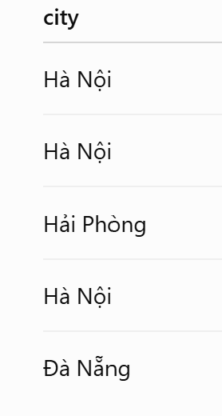
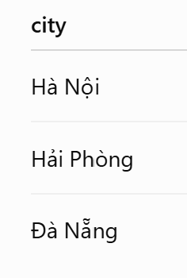

# Buổi 2: CƠ BẢN VỀ THIẾT KẾ CƠ SỞ DỮ LIỆU

## I. Tổng quan buổi học
### 1. Các thao tác cơ bản: SELECT, INSERT, UPDATE, DELETE, từ khóa AS, DISTINCT
### 2. Lọc dữ liệu: WHERE, HAVING
### 3. Kết hợp bảng và kết quả: JOIN, UNION
### 4. Tổng hợp và nhóm dữ liệu: COUNT, SUM, AVG, GROUP BY
### 5. Truy vấn con: Subquery
### 6. Thứ tự thực thi logic của truy vấn

## II. Các thao tác cơ bản: SELECT, INSERT, UPDATE, DELETE, từ khóa AS, DISTINCT
### 1. SELECT
- Lựa chọn các thuộc tính từ các hàng trong 1 hay nhiều bảng hoặc khung nhìn

- SELECT * FROM table_name; – Lấy tất cả các cột trong bảng.

- SELECT column1, column2 FROM table_name; – Lấy dữ liệu của các cột cụ thể trong bảng.

### 2. INSERT INTO
- Thêm dữ liệu mới vào một bảng

- INSERT INTO table_name (column1, column2) VALUES (value1, value2); – Thêm một dòng dữ liệu vào bảng.

- INSERT INTO table_name VALUES (value1, value2, ...); – Thêm một dòng dữ liệu mà không chỉ định tên cột.

### 3. UPDATE
- Cập nhật giá trị của các cột trong bảng. Lệnh này thường dùng để sửa đổi dữ liệu đã có trong cơ sở dữ liệu.

```sql
UPDATE  tablename 
   SET columnname = expression [, columnname = expression ]
   [ WHERE conditionlist ];
```

> điều kiện WHERE là không bắt buộc trong câu lệnh UPDATE. Nếu không có điều kiện WHERE, thì câu lệnh UPDATE sẽ được thực hiện trên tất cả các bản ghi của bảng đó.

### 4. DELETE
- Xóa một hay nhiều bản ghi ra khỏi bảng

```sql
DELETE FROM tablename 
        [WHERE conditionlist ];

```

### 5. AS
- Đặt tên tạm (bí danh/alias) cho một thứ trong câu SQL. Nó không thay đổi tên thật trong database. Thường hữu ích khi đặt bí danh cho 1 biểu thức

```sql
SELECT price * quantity AS total
FROM OrderDetail;
``` 

### 6. DISTINCT
- Loại bỏ dữ liệu trùng, giữ lại giá trị duy nhất, có xét cả tổ hợp 

VD: 
```sql
SELECT DISTINCT city [, ...] FROM customer; 
```



## III. Lọc dữ liệu: WHERE, HAVING
### 1. WHERE
- Lệnh WHERE được sử dụng để lọc dữ liệu theo các điều kiện cụ thể. Bạn có thể sử dụng các toán tử so sánh như =, <, >, <=, >=, <> để lọc dữ liệu.

```sql
SELECT * FROM table_name WHERE column_name = value; – Lọc các dòng dữ liệu có giá trị bằng value.
SELECT * FROM table_name WHERE column_name > value; – Lọc các dòng có giá trị lớn hơn value.
SELECT * FROM table_name WHERE column_name BETWEEN value1 AND value2; – Lọc các dòng có giá trị trong khoảng giữa value1 và value2.
```
### 2. HAVING
- Lệnh HAVING được sử dụng để lọc các nhóm sau khi bạn đã thực hiện lệnh GROUP BY. Điều này khác với lệnh WHERE vì WHERE lọc trước khi nhóm các bản ghi, còn HAVING lọc sau khi nhóm dữ liệu.

```sql
SELECT column_name, COUNT(*) FROM table_name GROUP BY column_name HAVING COUNT(*) > 5; – Lọc các nhóm có số bản ghi lớn hơn 5.
```

## IV. Kết hợp bảng và kết quả: JOIN, UNION


## V. Tổng hợp và nhóm dữ liệu: COUNT, SUM, AVG, GROUP BY
COUNT() → đếm số dòng trong nhóm
SUM() → tính tổng
AVG() → tính trung bình
MAX() → lớn nhất
MIN() → nhỏ nhất

```sql
SELECT department, COUNT(*)
FROM employee
GROUP BY department;
```
> VD: Mỗi department sẽ trở thành 1 nhóm và COUNT sẽ đếm số nhân viên của từng nhóm

## VI. Truy vấn con: Subquery
## VII. Thứ tự thực thi logic của truy vấn
